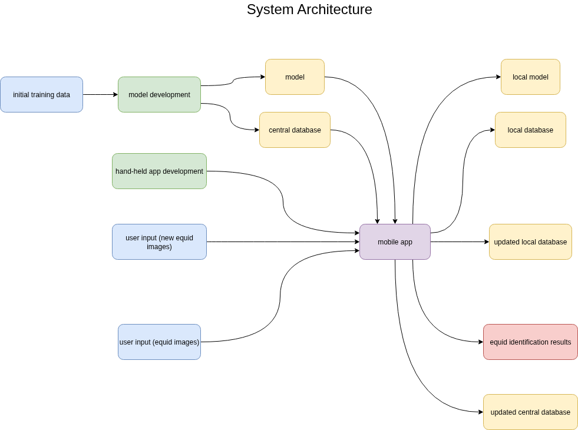

# System Architecture

## Flow Description

1. Both the **model** and the (initial) **central database** are hosted on a cloud server, produced from the training pipeline.
2. The **mobile app** keeps a copy of both the **model** and the **database** for offline use.
3. When a user wants to identify an equid, they take a photo using the mobile app.
4. The app preprocesses the image (e.g., resizing, normalization) and uses the local model to extract features from the equid's face.
5. The extracted features are compared against the local database to find the best match.
6. If a match is found, the app displays the equid's information to the user.
7. If no match is found, the user can choose to register the new equid by providing additional information and uploading the image.
8. The new equid's data is stored locally and queued for synchronization with the central database when an internet connection is available.
9. Periodically, the mobile app syncs with the central server to update the local model and database with any new entries or improvements made on the server side.
10. The central server also collects anonymized usage data to monitor performance and improve the model over time.

